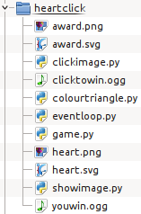
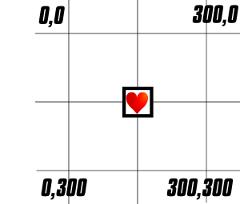

Heart Click
===========

This is going to be our first "Arcade" game, one with images
and a fast-paced mouse-based interaction:

* We are going to show an image (a heart)
* We are going to move that image around the screen
* The user needs to click on the heart with the mouse to win

(Let's see what the finished game will look like)...

.. note::

    This is going to take a few weeks, likely.
    Don't expect to finish the whole game today.
    If you are feeling lost, feel free to work with a friend.

First, A Pink Screen
--------------------

You can `download this file <./exercises/heartclick/eventloop.py>`_ .
To do that, use the **right-hand** mouse-button to click on the link. 
Choose "Save Link As" and save the file to your H:\ drive.
We are going to walk through what's going on in the file so you 
understand how an "event loop" works.

.. literalinclude:: exercises/heartclick/eventloop.py
    :language: python

If we save and run this file, we'll see an empty pink window.

Our game works like this:

* we loop forever and for every trip round the loop
* we check to see if the user has done anything and update our "model" of the game

  * currently we just check to see if they asked us to exit

* we "render" the game into memory
* we "flip" the rendered game board onto the screen (make it visible)

Adding a Heart
--------------

We need to draw a heart, so we need to get an image of a heart to draw.
We are going to save two images in the same directory as our `game.py` script:

* `heart.png <./exercises/heartclick/heart.png>`_
* `award.png <./exercises/heartclick/award.png>`_

To do so, use the **right-hand** mouse-button to click on the links above. Choose 
"Save Link As" and save the files to the directory where you are writing 
your game (on your H:\ drive).

 
But how do we find out *where* those files are for our game?
When we run a script we get a `__file__` variable defined
which points to the module which is being run (in our case,
this is the script `game.py`).

So how do we go from "the name of the python game file" to 
"the name of an image sitting next to the python game file"?

.. doctest::

    >>> import os
    >>> filename = '/path/to/filename.py'
    >>> os.path.dirname(filename)
    '/path/to'
    >>> HERE = os.path.dirname(filename)
    >>> os.path.join( HERE, 'heart.png' )
    '/path/to/heart.png'

So in our game, we want to modify the game-setup code to 
find the `heart.png` file:
    
.. literalinclude:: exercises/heartclick/game.py
    :language: python
    :start-after: #find_image_start
    :end-before: #find_image_stop

Great, but now how do we actually use the image file in our game?
We are going to use the `pygame.image` library's `load` function 
to open the image filename and give us an image "object" that 
we can use to draw the image onto the screen.
    
.. literalinclude:: exercises/heartclick/game.py
    :language: python
    :start-after: #load_image_start
    :end-before: #load_image_stop

.. note:: Why .convert_alpha(screen)?

    You will note that we called `convert_alpha` on the thing we 
    loaded from the file. We did that in order to make the image 
    `compatible` with the screen onto which we will be drawing.

Where To Draw
+++++++++++++

When we ask the computer to put the image of the heart onto the 
screen, we need to tell it **where** to copy the image. With Pygame
we do that by getting a `rectangle` into which we will copy the image.
We can move the rectangle around to move where we will copy the image.

We'll put this into the game-setup area of the game to calculate the 
initial rectangle for the heart.

.. literalinclude:: exercises/heartclick/game.py
    :language: python
    :start-after: #get_rectangle_start
    :end-before: #get_rectangle_stop

And now we are ready to actually copy the heart onto the screen when
we render the screen.  This is going to go into the game just after 
we fill the screen (the call to `screen.fill`):

.. literalinclude:: exercises/heartclick/game.py
    :language: python
    :start-after: #draw_image_start
    :end-before: #draw_image_stop

.. topic:: How do Computers Represent Images?

    Computer programs normally represent images as a grid of `pixels` 
    where each pixel has 3 colours, Red, Green and Blue (these are the 
    "Additive Primary Colours"). 
    
    We can combine light from those three colours to make most hues that 
    humans can see. The coverage is not perfect, but it works pretty well 
    in practice. The actual coverage of a computer display (its `gamut`)
    varies widely, as the cost of making a "near perfect" display is 
    far greater than the cost of making a "good enough" one.

    .. image:: ./images/colourtriangle.png
        :alt: RGB colour triangle

    When we make an image much larger we can see the individual pixels
    showing up:
    
    .. image:: ./exercises/heartclick/heart.png
        :width: 320
        :height: 320
        :alt: Blown up copy of heart.png
    
    The three colours are often referred to as "channels" in computer 
    science. In many formats there is also a 4th channel which determines
    how "transparent" image is at each pixel. This is often called the 
    "alpha" channel. (recall the convert_alpha call above).

Checking for a Heart-Hit
------------------------

Before we start moving the heart around, let's make it possible to 
win the game. We want to see if the user has clicked the mouse
inside the rectangle where we are currently drawing the heart
(`heart_rectangle`).

We will put this just after we check to see if the user has asked 
us to exit/quit:

.. literalinclude:: exercises/heartclick/game.py
    :language: python
    :start-after: #click_check_start
    :end-before: #click_check_stop

So now we know that the user has successfully hit the heart,
but how do we tell the user that they've won?

Rewarding the User
++++++++++++++++++
    
We need some way to tell the user that they've won, for 
now we'll just change the "heart" into an "award" and display
that. If you didn't download it yet, do so now:

* `award.png <./exercises/heartclick/award.png>`_

We'll modify the game-setup code to load the `award.png` file
in exactly the same way as we loaded `heart.png`, from a file 
sitting next to our game.
    
.. literalinclude:: exercises/heartclick/game.py
    :language: python
    :start-after: #load_award_start
    :end-before: #load_award_stop

To draw the award, we just make the name "heart" point at the 
image we loaded into the name "award":
    
.. literalinclude:: exercises/heartclick/game.py
    :language: python
    :start-after: #show_award_start
    :end-before: #show_award_stop

Now every time we go to render "heart" we will actually be rendering
"award". Because the images are the same size, we can use the 
"heart_rectangle" to blit the award without changing any other code.

Moving the Heart
----------------

So to move the heart, we need to change its x and y coordinate,
with the size of the x and y change being its "vector" of motion.

If the numbers are negative, the heart will move up/left, if they 
are positive, it will move down/right. The larger they are, the 
faster the heart will move.

.. literalinclude:: exercises/heartclick/game.py
    :language: python
    :start-after: #motion_setup_start
    :end-before: #motion_setup_stop

.. topic:: Tuples

    That ( <random>, <random> ) thing is a *tuple*, which is a 
    simple thing that can hold some number of other things.
    Python programmers often use them to hold together simple pieces 
    of information that are related to each other.
    
    We can pull information *out* of a tuple by "indexing" into 
    the tuple with square brackets.
    
    .. doctest::
    
        >>> direction = (1,2)
        >>> direction[0]
        1
        >>> direction[1]
        2
    
    Or by unpacking the tuple into separate variables:
    
    .. doctest::
    
        >>> direction = (1,2)
        >>> x,y = direction

Okay, so how do we actually get the rectangle to move?
We ask the rectangle to "move" itself with its move method.

.. literalinclude:: exercises/heartclick/game.py
    :language: python
    :start-after: #update_motion_start
    :end-before: #update_motion_stop

Bouncing Heart
--------------

It's not a very fun game if the heart goes off-screen in
a second. We need to make the heart bounce when it hits the 
edge of the screen.

.. literalinclude:: exercises/heartclick/game.py
    :language: python
    :start-after: #bounce_start
    :end-before: #bounce_stop

Randomizing Motion
------------------

Now the game is a bit too easy, so let's add a bit of randomness
to the heart's motion:

.. literalinclude:: exercises/heartclick/game.py
    :language: python
    :start-after: #random_motion_start
    :end-before: #random_motion_stop

Exiting on Winning
------------------

As well as changing the heart to an award, we could exit the 
game when the user wins:

.. literalinclude:: exercises/heartclick/clickimage.py
    :language: python
    :start-after: #timer_exit_start
    :end-before: #timer_exit_stop

Audio Prompts
-------------

Instead of just exiting silently, we could play a congratulations 
and exit when that finishes:

.. literalinclude:: exercises/heartclick/game.py
    :language: python
    :start-after: #audio_prompts_start
    :end-before: #audio_prompts_stop

Modify the "when the user wins" section to play the `youwin.ogg` file
and exit when it finishes playing.
    
.. literalinclude:: exercises/heartclick/game.py
    :language: python
    :start-after: #audio_award_start
    :end-before: #audio_award_stop

Final Sample Code
-----------------

You can download the full source code for the game, including 
audio prompts:

* `game.py <exercises/heartclick/game.py>`_
* `clicktowin.ogg <exercises/heartclick/clicktowin.ogg>`_
* `youwin.ogg <exercises/heartclick/youwin.ogg>`_
* `heart.png <exercises/heartclick/heart.png>`_
* `award.png <exercises/heartclick/award.png>`_

.. literalinclude:: exercises/heartclick/gameclean.py
    :language: python

Documentation
-------------

Pygame's documentation is available online:

* `Pygame Documentation <http://www.pygame.org/docs/>`_
    
Ideas
-----

Modify your game to:

* Use different images or audio prompts

  * For example: http://webtoys.vrplumber.com/saywhat?words=You+rock&format=ogg
    
* Over time, make the heart move faster, or change direction more frequently
* Define a "no win" situation (took too long, or clicked too many times)
