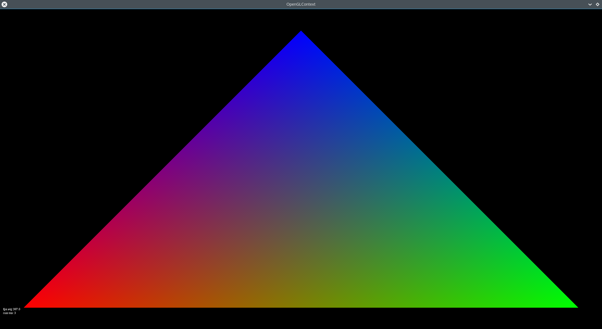

How do Computers Represent Images?
===================================

Computer programs normally represent images as a grid of `pixels` 
where each pixel has 3 colours, Red, Green and Blue (these are the 
"Additive Primary Colours"). 

We can combine light from the three primary colours to make most hues that 
humans can see. The coverage is not perfect, but it works pretty well 
in practice. The actual coverage of a computer display (its `gamut`)
varies widely, as the cost of making a "near perfect" display is 
far greater than the cost of making a "good enough" one.

We can poke at the `surface` we just loaded to see what the pixel
colours are:

.. doctest::

    >>> import pygame.image
    >>> image = pygame.image.load('heartclick/heart.png' )
    >>> image
    <Surface(32x32x32 SW)>
    >>> image.get_at((16,16))
    (241, 0, 0, 255)
    >>> image.get_at((0,0))
    (0, 0, 0, 0)

We see the first color is (241,0,0) (a very bright red), while the 
pixel in the top-left corner is (0,0,0) (black). (Do you see black
in the image above?).

The three colours are often referred to as "channels" in computer 
science. In many image formats there is also a 4th channel which determines
how opaque or transparent the image is at each pixel. This is often called the 
"alpha" channel. In the sample above you can see that the top-left corner (0,0)
is completely transparent (low alpha) while the center pixel (16,16) is entirely
opaque (high alpha).

.. image:: ./exercises/heartclick/alphaexample.png
    :alt: Alpha combination example

We use the alpha channel to allow us to copy images such that they are not a 
`block` but whatever shape we want them to be.

Image File Formats (PNG, JPEG)
------------------------------

The files we are loading are Portable Network Graphics (PNG) files.
There are hundreds of image file formats, but the most common ones 
you will see are PNG and JPEG files.

PNG files can contain an alpha channel (transparency information),
but are generally much larger than JPEG files for the same size of 
image. Both files are "compressed" (made smaller), but JPEG files 
throw away information in order to make the file-size smaller 
(they are `lossy`), while PNG files always have all of the 
information from the original image (the are `lossless`).

Image file formats are fairly complex, and can include a *lot* of 
extra information. We almost always use a `library` of pre-written
code to handle loading and manipulating an image. The content of 
a PNG files is basically a lot of binary-encoded data and *somewhere*
in there your image is hiding:

.. doctest::

    >>> content = open('heartclick/heart.png','rb').read()
    >>> content[:20]
    b'\x89PNG\r\n\x1a\n\x00\x00\x00\rIHDR\x00\x00\x00 '
